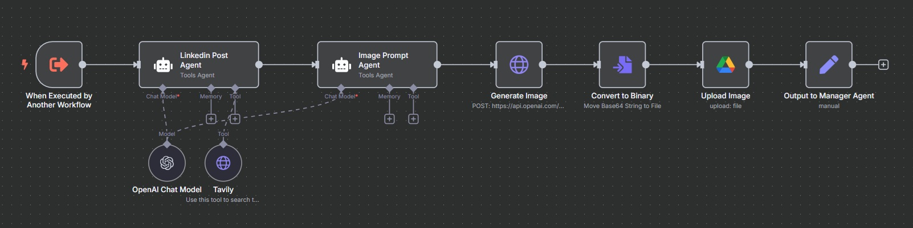

# Tuli: The AI-Powered Smart SMB Marketing Assistant
Created by [Louise McCall](https://www.linkedin.com/in/louise-mccall-b94413111/) for the WAIPRACTICE March 2025 Cohort

## Overview  
**Tuli** is an AI-powered, low-code marketing assistant built using [n8n](https://n8n.io). It enables small and medium businesses to automate their content marketing across platforms — from social media copy to blog articles, video generation, and analytics — all powered by LLMs, prompt engineering, and real-time tools.

> “Designed to remove the barriers to high-quality marketing, Tuli makes content creation as simple as submitting a form.”

---
## Key Features

- **Multi-platform content generation** across LinkedIn, Twitter, Instagram, Facebook and Blogs
- **Voiceover script writing** and audio generation via ElevenLabs
- **AI-based image and storyboard generation** (Flux, RunwayML, OpenAI GPT-Image-1)
- **Short video generation pipeline** using RunwayML + Creatomate
- **Analytics workflow** for post-performance tracking and content adaptation
- **Audience profiling** and dynamic content personalisation  
- **Human-in-the-loop feedback** to improve AI output over time
- **Google Drive integration** for storing and managing media assets
- **Single Manager Agent** that orchestrates the entire process via natural language input

---

## Workflow Snapshots
> All workflows are built in **n8n**, using nodes, conditional logic, and AI agents.

| Module | Screenshot |
|--------|------------|
| Main Agent |  |
| Sub Workflow |  |
| Short Video Generator |  |
| Product Videography |  |
| Analytics Report |  |

> You can find editable `.json` exports of these workflows in the `/workflows/` folder.

---

## Sample Output

> See [Presentation - Smart SMB Assistant](Smart-SMB-Assistant-LouiseMcCall.pdf) for a full overview with visuals.

---

## Requirements

To run this project, you'll need:
- [n8n](https://n8n.io) (self-hosted or desktop version)
- API keys for:
  - OpenAI / OpenRouter - Content generation, prompt execution
  - Google Gemini - Generate analytics reports using Gemini Pro
  - Tavily search - Real-time search for prompt enrichment  
  - ElevenLabs - Text-to-speech (voiceover and Sound effects audio)  
  - RunwayML - Video generation from images     
  - Creatomate - Final video rendering with audio overlays
  - Apify - Scrape LinkedIn post analytics and metadata 
- Google Drive - Upload, Share, and retrieve images/video files
- Google Sheets - Log content and reports
- Gmail - send output content via email

---

## How to Use

1. Clone or download this repo
2. Import `.json` files into your n8n instance
3. Set up credentials
4. Use the form trigger to submit a new campaign topic and audience
5. Let Tuli generate posts, images, videos, and send them to your inbox

---

## Future Improvements
We envision several enhancements to make Tuli more powerful, scalable, and user-friendly:

- Voice-activated form submission
- Batch content scheduling and publishing - Integrate with Buffer, Notion, or Google Calendar** for weekly/monthly campaign planning
- Enhanced analytics - Cross-platform analytics and Integration with Looker Studio for analytics

---

## Mentor  
[**Toma Ijatomi**](https://www.linkedin.com/in/toma-ijatomi/) – Data Scientist & Machine Learning Engineer

## License  
© 2025 Louise McCall. All rights reserved.
